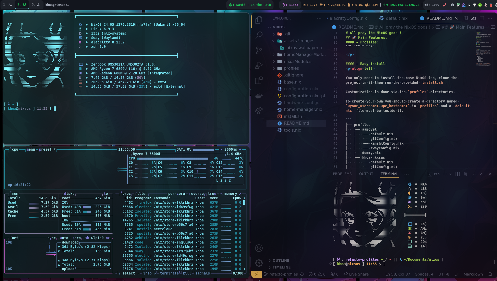
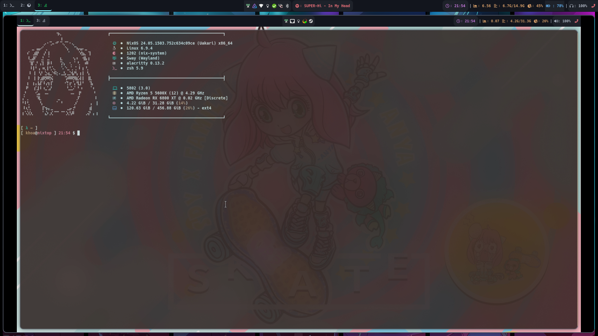

# All pray the NixOS gods !

## 🔍 Description:

<p align=left>

In this project lies the NixOS configuration files leading to our own custom configured NixOS installation.

It has for objective to be flexible with opt-in/opt-out options while still being able to mutualize some of it.

### Wayland/Sway with UEFI BOOT only for now !

</p>

## 🚀 Main Features:

#### - Reproductibility:
<p align=left>

Everything as code and reproductible thanks to Nix.

</p>

#### - Modern Zsh shell:
<p align=left>

A bunch of plugins and GNU cli replacers are pre-installed.

</p>

#### - Profiles:
<p align=left>

In this project, it's possible to add Nix code on top the base to customize your way out (git config, opt-in/opt-out for features).

</p>

#### - Easy Install:
<p align=left>

You only need to install the base NixOS iso, clone the project in it then run the provided `install.sh`.

```
Usage: install.sh [USERNAME] [HOSTNAME] [--help]

This script installs and configures a NixOS server.

Arguments:
  USERNAME      The desired main username. If not provided, you will be prompted to enter it.
  HOSTNAME      The desired hostname. If not provided, you will be prompted to enter it.
  --help        Display this help message and exit.

Example:
  install.sh myuser myhost
```

Customization is done via the `profiles` directories.

To create your own you should create a directory named `<your_username>-<pc_hostname>` in `profiles` and a `default.nix` file must be inside it.

```
├── profiles
│   ├── aamoyel
│   │   ├── default.nix
│   │   ├── gitConfig.nix
│   │   ├── kanshiConfig.nix
│   │   └── swayConfig.nix
│   ├── dummy.nix
│   └── khoa-nixsus
│       ├── default.nix
│       ├── gitConfig.nix
│       ├── kanshiConfig.nix
│       └── swayConfig.nix
```

By default, if no directory exists named with your `username` and `hostname`, it will use the `dummy.nix`.

You can use the `dummy.nix` as `default.nix` and customize it on top of it. It should contains default parameters.
</p>


#### - Screenshot:


with headless sunshine/moonlight configuration (remote desktop):


