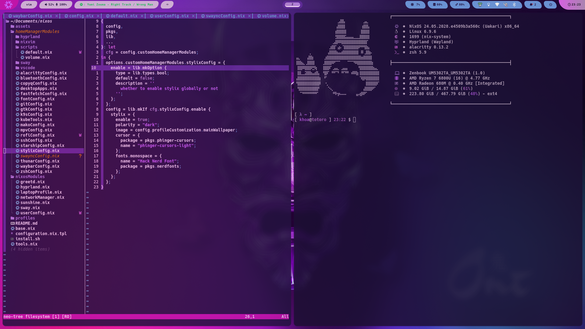
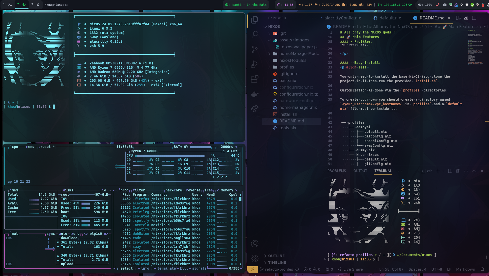
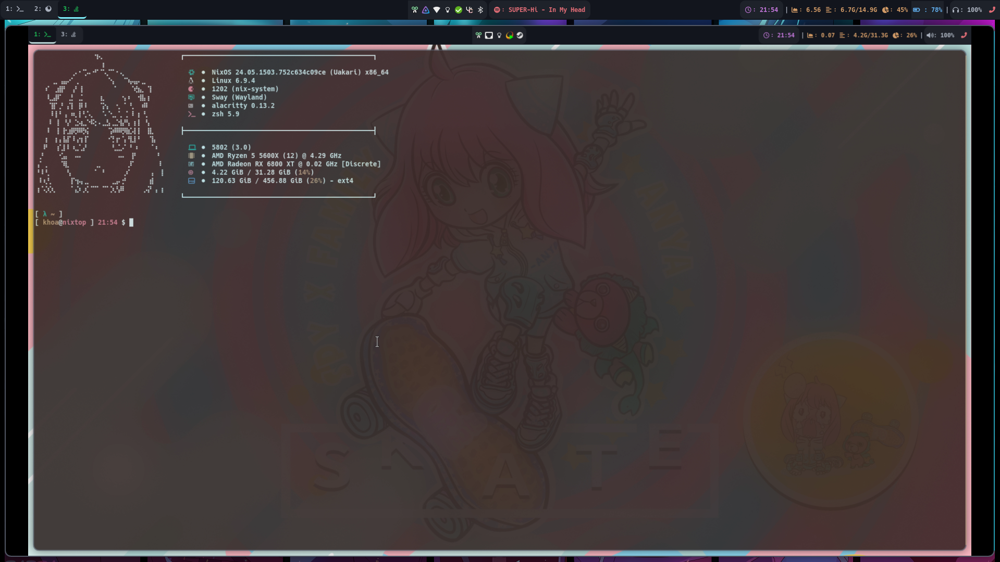
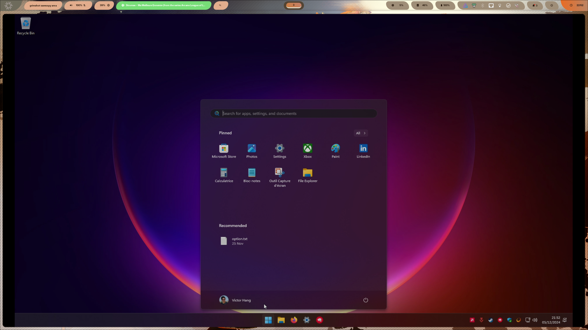

# Nixbook

[](https://github.com/didactiklabs/nixbook/actions/workflows/build-totoro.yaml)
[](https://github.com/didactiklabs/nixbook/actions/workflows/build-nishinoya.yaml)
[](https://github.com/didactiklabs/nixbook/actions/workflows/build-anya.yaml)

## 🔍 Description

<p align=left>

In this project lies the NixOS configuration files leading to our own custom configured NixOS installation.

It has for objective to be flexible with opt-in/opt-out options while still being able to mutualize some of it.

### Wayland with UEFI BOOT only for now

</p>

## 🚀 Main Features

#### - Reproductibility

<p align=left>

Everything as code and reproductible thanks to Nix.

</p>

#### - Modern Zsh shell

<p align=left>

A bunch of plugins and GNU cli replacers are pre-installed.

</p>

#### - Profiles

<p align=left>

In this project, it's possible to add Nix code on top the base to customize your way out (git config, opt-in/opt-out for features).

</p>

#### - Easy Install and upgrades

<p align=left>

You only need to install the base NixOS iso.

Customization is done via the `profiles` directories.

If it's your first install run (we assume you have colmena installed):

```bash
colmena apply-local --sudo  -v switch
```

To update:

```bash
ginx --source https://github.com/didactiklabs/nixbook -b main --now -- colmena apply-local --sudo
```

Profile selected is based on the output of `hostname`.

</p>

#### - Screenshot

with hyprland v2:



with sway v1:



with headless sunshine/moonlight configuration (remote desktop) v1:



with headless sunshine/moonlight configuration (remote desktop) v2, running windows:


