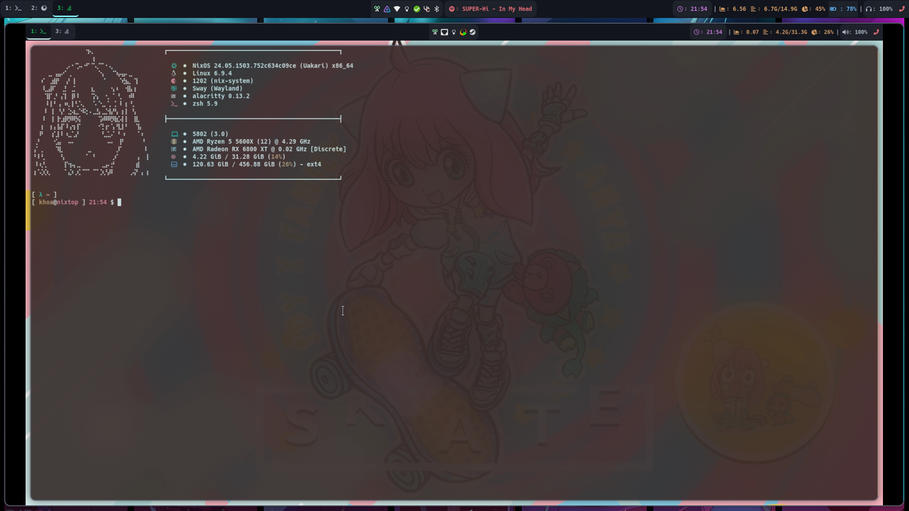
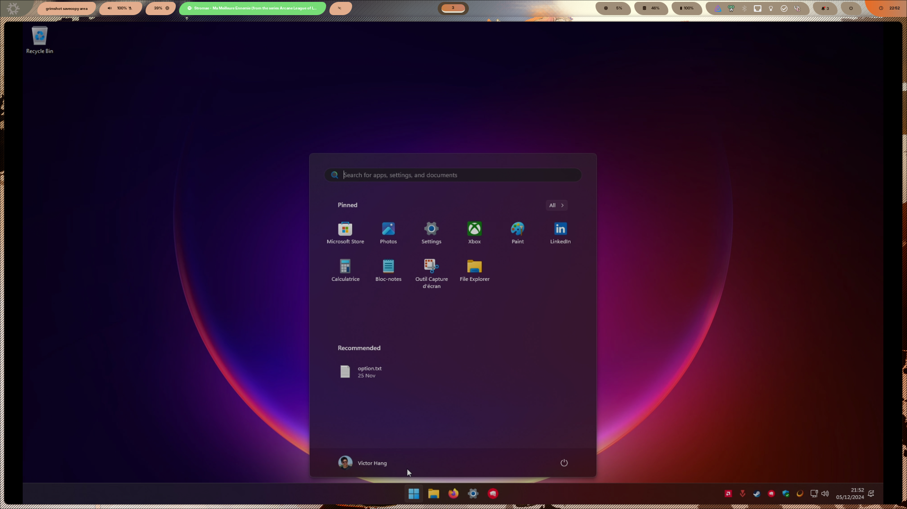

# Nixbook

[](https://github.com/didactiklabs/nixbook/actions/workflows/build-totoro.yaml)
[](https://github.com/didactiklabs/nixbook/actions/workflows/build-nishinoya.yaml)
[](https://github.com/didactiklabs/nixbook/actions/workflows/build-anya.yaml)

## 🔍 Description

### Project Goals

The primary goal of Nixbook is to provide a personal, highly customizable, and reproducible NixOS environment. It aims to offer a robust base configuration that can be easily extended and adapted to different machines and use cases, promoting the "everything as code" philosophy through Nix. This allows for consistent deployments and easy management of system configurations.

### Wayland with UEFI Boot

Currently supports Wayland display servers with UEFI boot only.

## 🚀 Main Features

**Reproducibility**

Everything is configured as code with Nix, ensuring consistent and reproducible deployments across systems.

**Modern Zsh Shell**

Pre-configured with various plugins and GNU CLI replacements for an enhanced shell experience.

**Machine Profiles**

Customize your setup per machine using profile configurations. Add custom Nix code for features like git configuration and opt-in/opt-out functionality.

**Easy Installation and Updates**

After installing the base NixOS ISO, customize your system using profiles. Profile selection is automatic based on your hostname.

Initial setup:

```bash
colmena apply-local --sudo -v switch
```

Update your system:

```bash
osupdate
```

Or manually:

```bash
ginx --source https://github.com/didactiklabs/nixbook -b main --now -- colmena apply-local --sudo
```

## 🐧 Using Home Manager on Non-NixOS Distributions

Nixbook's Home Manager modules can be used on any Linux distribution (Ubuntu, Fedora, Arch, etc.) to manage your user-level configurations declaratively. This allows you to replicate your Nix-based dotfiles environment without installing NixOS.

### Prerequisites

1. **Install Nix** on your system:

   ```bash
   curl --proto '=https' --tlsv1.2 -sSf -L https://install.determinate.systems/nix | sh -s -- install
   ```

2. **Install Home Manager** (standalone mode, no flakes required):

   ```bash
   nix-shell '<home-manager>' -A install
   ```

### Import Nixbook Home Manager Config (Without Flakes)

#### Setup

Clone the Nixbook repository and set up Home Manager configuration:

```bash
# Clone the nixbook repository
git clone https://github.com/didactiklabs/nixbook ~/.config/nixbook

# Create Home Manager config directory
mkdir -p ~/.config/home-manager
```

#### Create Your Home Manager Configuration

Create `~/.config/home-manager/home.nix`:

```nix
{ config, pkgs, ... }:

let
  nixbookPath = /home/khoa/.config/nixbook;  # Change 'khoa' to your username
in
{
  home.username = "khoa";  # Change to your username
  home.homeDirectory = "/home/khoa";  # Change to your home directory
  home.stateVersion = "24.05";  # Match your Home Manager version

  # Import Nixbook's Home Manager modules
  imports = [
    (import "${nixbookPath}/homeManagerModules/entrypoint.nix")
  ];

  # Optional: Override or add custom configurations
  # home.packages = with pkgs; [ ... ];
}
```

#### Import Specific Modules (Instead of All)

If you prefer to cherry-pick modules instead of importing everything:

```nix
{ config, pkgs, ... }:

let
  nixbookPath = /home/khoa/.config/nixbook;
in
{
  home.username = "khoa";
  home.homeDirectory = "/home/khoa";
  home.stateVersion = "24.05";

  # Import only specific modules
  imports = [
    "${nixbookPath}/homeManagerModules/zshConfig.nix"
    "${nixbookPath}/homeManagerModules/kittyConfig.nix"
    "${nixbookPath}/homeManagerModules/starshipConfig.nix"
    "${nixbookPath}/homeManagerModules/gitConfig.nix"
    "${nixbookPath}/homeManagerModules/nixvim"
  ];
}
```

#### Enable Home Manager

Install and enable Home Manager (standalone, one-time setup):

```bash
nix-shell '<home-manager>' -A install
```

### Activating Your Home Manager Configuration

```bash
# Activate the configuration
home-manager switch

# Or, switch with verbose output for debugging
home-manager switch -v
```

#### First Activation

On first activation, Home Manager may ask about replacing existing dotfiles. You can:

```bash
# Let Home Manager manage the files
home-manager switch

# Or, see what changes it would make first
home-manager build
```

---

**Screenshots**

Niri:


Headless sunshine/moonlight (remote desktop) v1:



Headless sunshine/moonlight (remote desktop) v2 with Windows:


